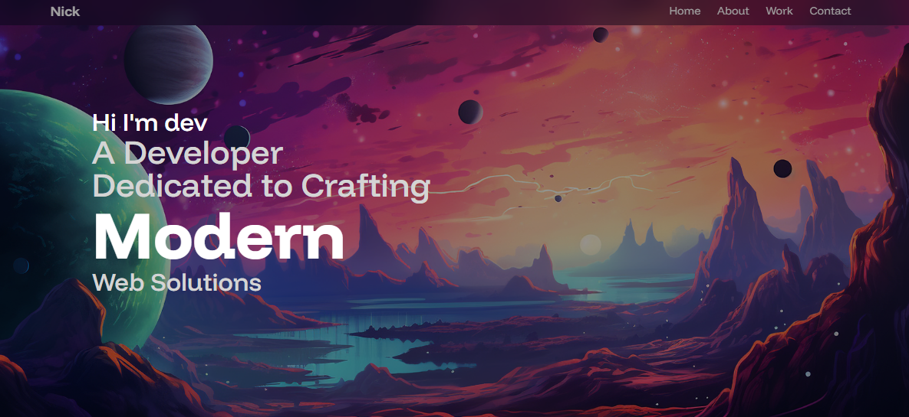
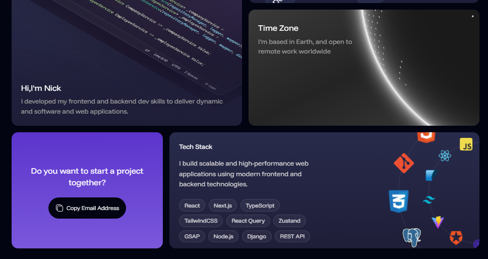
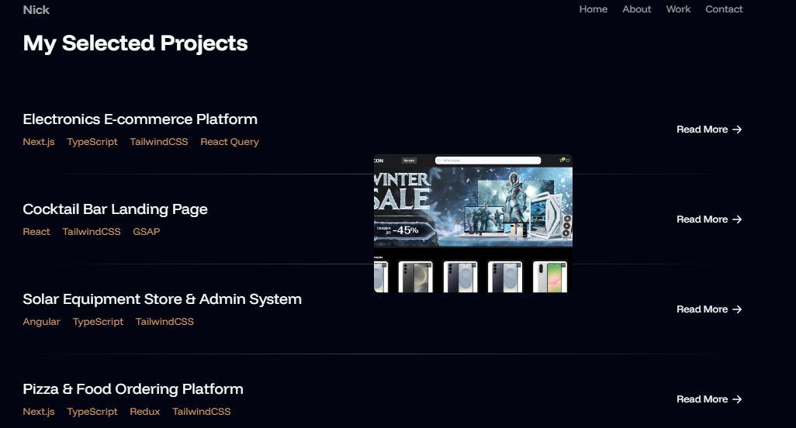
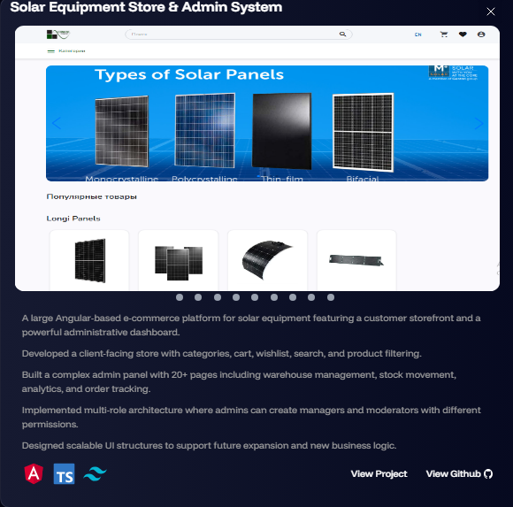

# 🌐 Personal Portfolio

A modern, animated portfolio website built with **React**, **Framer Motion**, and **Tailwind CSS**, showcasing all my projects, skills, and work experience.  
The site is fully responsive, interactive, and designed to highlight my capabilities as a full-stack developer.

---







Live Demo: [View Portfolio](https://mistercat752.github.io/My-portfolio/)
## 🚀 Tech Stack

- React 19
- Vite
- Tailwind CSS 4
- Framer Motion
- React Slick (carousel/slider)
- EmailJS (contact form)
- Responsive design with react-responsive
- Tailwind Merge (className management)

---

## ✨ Key Features

- Interactive hero section with animated typography and elements
- Projects showcase slider combining multiple technologies
- Dynamic presentation of work experience
- Contact form integrated with EmailJS for direct messages
- Smooth animations across sections powered by Framer Motion
- Fully responsive design for desktop, tablet, and mobile
- Easy-to-maintain and extendable component structure

---

## 🏗 Architecture & Design Philosophy

- Component-based architecture: each section (About, Projects, Experience, Contact) is self-contained
- Animations separated from content for maintainability
- Carousel slider used to showcase multiple projects interactively
- State and effects managed locally within components using React hooks
- Designed for scalability: new projects or experiences can be added without refactoring

---

## 🎨 UX & Motion Highlights

- Animated page transitions using Framer Motion
- Micro-interactions for buttons, links, and hover states
- Smooth slider animations with react-slick
- Typographic and layout consistency to maintain a clean visual identity
- Focused on performance and accessibility

---

## ⚙️ Getting Started

### 1. Clone the repository

```bash
git clone <https://github.com/MisterCat752/My-portfolio.git>
cd portfolio


2. Install dependencies
npm install

3. Run development server
npm run dev

4. Build for production
npm run build
npm run preview
```
